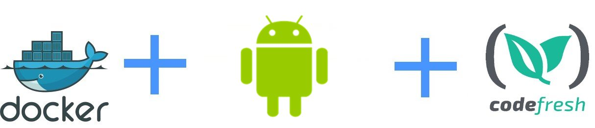

# Building Android applications with Codefresh



This is an example Android application that uses gradle.
It is compiled using Codefresh. More details can be found in [the documentation page](https://codefresh.io/docs/docs/learn-by-example/mobile/android/).

If you are looking for a vanilla Gradle application, then see this [example](https://github.com/codefresh-contrib/gradle-sample-app)


## Instructions

To test locally

```
./gradlew test
```

To build locally

```
./gradlew build
```


## To use this project in Codefresh 

There is also a [codefresh.yml](codefresh.yml) for easy usage with the [Codefresh](codefresh.io) CI/CD platform.


Enjoy!

